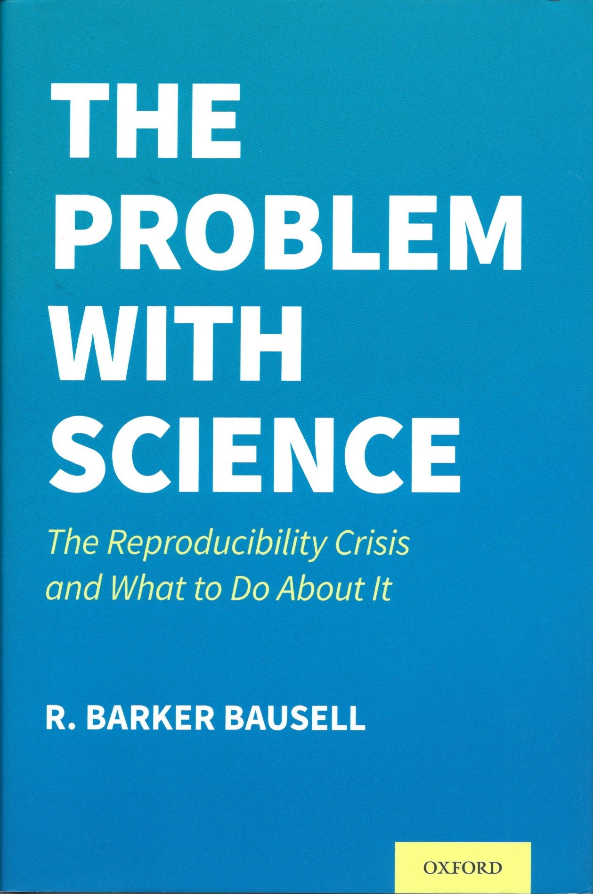

--- 
title: "PSYCH 490.002 Spring 2023"
subtitle: "Class Number 18701"
author: "Rick O. Gilmore, Ph.D."
date: "`r Sys.Date()`"
site: bookdown::bookdown_site
documentclass: book
bibliography: [include/bib/packages.bib, include/bib/psu-repro.bib]
biblio-style: "apa-like"
# cover-image: path to the social sharing image like images/cover.jpg
description: |
  This is the course material for PSYCH 490.002.
link-citations: yes
github-repo: "psu-psychology/psych-490-reproducibility-2023-spring"
url: 'https\://psu-psychology.github.io/psych-490-reproducibility-2023-spring/'
---

# (PART) Syllabus {-}

# About the course {-}

```{r, echo=FALSE, out.width="20%"}
knitr::include_graphics("include/img/chambers-seven-deadly-sins.jpg")
knitr::include_graphics("include/img/ritchie-science-fictions.jpg")

knitr::include_graphics("include/img/harris-rigor-mortis.jpg")
knitr::include_graphics("include/img/oreskes-why-trust-science.jpg")
```

Much attention has focused on the reproducibility of research in psychology, but the challenges of producing robust and reliable knowledge extend to all scientific disciplines. In this seminar, we will discuss whether there is or is not a reproducibility crisis in psychology and in science more broadly. We will discuss how initiatives to make scientific research more open and transparent can also make it more reproducible and robust.

## Instructor {-}

Rick O. Gilmore, Ph.D.
Professor of Psychology
rog1 AT-SIGN psu PERIOD edu

Schedule an appointment: <https://psu.zoom.us/my/rogilmore></br>
Lab web site: <https://gilmore-lab.github.io>

## Teaching Assistant {-}

TBD

## Meeting time & location {-}

Tuesday and Thursday 10:35 AM - 11:50 AM ET</br>
[Nursing Sciences Building](https://map.psu.edu/?id=1134#!ct/59509,33177,25403,26748,26749,26750,27255?m/302604) 323

```{r include=FALSE}
# automatically create a bib database for R packages
knitr::write_bib(c(
  .packages(), 'bookdown', 'knitr', 'rmarkdown'
), 'include/bib/packages.bib')
```
